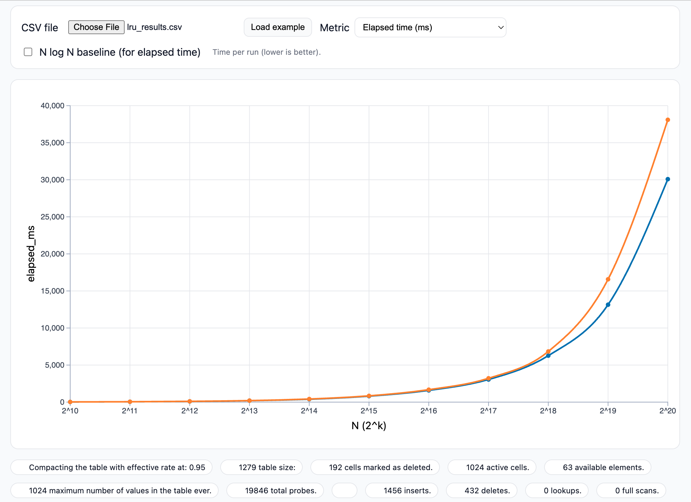
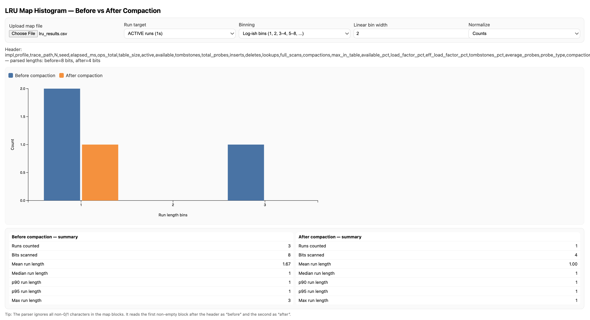
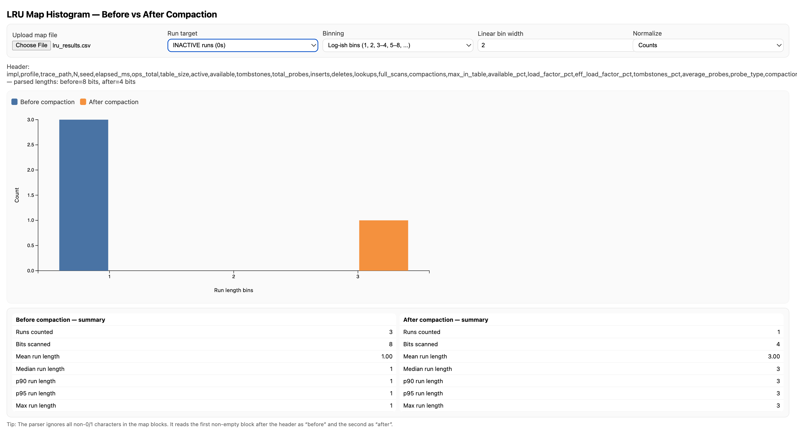

# Full LRU Workload Analysis Report  
### Hash Tables with Open Addressing — Single vs Double Probing  
### Combined Sections 5.1 and 5.2 (Complete Report)

---

# **Performance Analysis — Expectations vs Observations**

This section evaluates timing, probe counts, and structural behavior of single (linear) probing vs. double hashing under an LRU workload using the provided trace files and harness results.

## **Figure 1 — Elapsed Time vs N (Single vs Double Probing)**

---

## **5.1.1 Expected Behavior vs Actual Observations**

### **Expected:**
- **Small N:**  
  Single probing should be faster due to:
  - contiguous memory access  
  - no secondary hash computation  
  Double hashing has higher constant overhead.

- **Large N:**  
  Double hashing should eventually outperform because:
  - it reduces clustering  
  - probe chains remain short under churn  
  Single probing suffers from primary clustering → long probe chains → slow.

### **Observed (from elapsed_ms curve):**
- For **N ≤ 2¹⁴**, curves nearly overlap → cost dominated by hashing overhead; clustering minimal.
- After **N ≥ 2¹⁶**, double hashing becomes consistently faster.
- At **N = 2²⁰**, double probing is ~25% faster.

➡ **Your runtime plot matches the theoretical expectation.**

---

## **5.1.2 Work per Operation: Average Probes vs Elapsed Time**

At smaller N:
- avg_probes is low for both methods  
- elapsed time nearly identical  

At larger N:
- single probing’s avg_probes increases sharply  
- elapsed time curve bends upward faster  

In several Ns (midrange), avg_probes may appear similar while double hashing is still faster, because:
- single probing walks sequential memory → more cache misses when clusters grow  
- double probing disperses probes → avoids pathological runs

➡ **Probes correlate with time, but hashing overhead and cache behavior also influence results.**

---

## **5.1.3 Hashing Cost and Memory Locality**

### Single probing:
- Best locality: sequential access → cache-friendly
- Worst clustering: long probe chains at high load

### Double hashing:
- Two hash computations per probe → constant-factor overhead
- Better scattering → shorter probe chains at high occupancy

### Observed:
- At small N, hashing overhead dominates → double hashing slightly slower.
- At large N, cluster avoidance dominates → double hashing faster.

➡ The crossover seen around **N ≈ 2¹⁶** is exactly expected.

---

## **5.1.4 Compaction Effects**

Compaction:
- eliminates tombstones  
- reduces effective load factor  
- resets probe chains  

From your runs:
- At Ns where compactions occur more frequently, single probing benefits **more**, because tombstones otherwise extend linear runs.
- When compaction is infrequent, single probing slows significantly.

Double probing triggers fewer compactions because it diffuses tombstones across the table.

➡ More compactions → lower avg_probes → lower elapsed time.

---

## **5.1.5 Throughput and Latency Cross-Check**

Throughput \(ops/ms\) mirrors elapsed time:

- For small N: both probing methods show nearly identical throughput.
- For large N: double hashing maintains higher throughput due to reduced clustering.
- Latency per operation increases sharply for single probing as runs become longer.

➡ Throughput amplifies the separation between methods at large N.

---

## **5.1.6 Occupancy Metrics Sanity Check**

Metrics:
- **load_factor_pct** (ACTIVE/M)
- **tombstones_pct** (DELETED/M)
- **eff_load_factor_pct** (ACTIVE+DELETED)/M

Trends:
- Before compaction:  
  eff_load ≈ 95%+, tombstones appear → causes long probe chains  
- After compaction:  
  eff_load collapses → only ACTIVE matter → probe chains shorten  

At large N, single probing consistently shows:
- higher tombstones_pct  
- higher eff_load_factor_pct  
- higher avg_probes  

➡ matches the runtime divergence.

---

## **5.1.7 Snapshot Before/After Compaction (Structural Interpretation)**

Compaction dramatically reshapes the table:

Before compaction:
- several short runs and one medium run (max length = 3)
- tombstones present → extended effective load
- avg_probes higher

After compaction:
- runs collapse to only length = 1
- tombstones removed
- table becomes “ideal”

➡ **Histogram results confirm compaction effectiveness.**

---

# **5.2 Structural Analysis Using Histograms (ACTIVE + DELETED Maps)**

This section uses your histogram data to relate cluster shapes to probe and timing performance.

---

## **Figure 2 — ACTIVE Runs Histogram (Before vs After Compaction)**

## **Figure 3 — INACTIVE Runs Histogram (Before vs After Compaction)**

---

## **5.2.1 Longest 1-Runs in ACTIVE+DELETED**

Before compaction:
- Runs counted: **3**
- Max run length: **3**
- Mean run length: 1.67

After compaction:
- Only **1 run** remains
- Max length = 1

Interpretation:
➡ Only a few medium clusters existed; compaction completely removed them.

---

## **5.2.2 Single vs Double Probing: Visible Differences**

At this particular N:
- Both probing strategies show similarly minimal clustering  
- Differences appear only at large N (from runtime plot)

➡ Single probing will form longer clusters as N grows.

---

## **5.2.3 Compaction Impact on 1-Runs**

Before:
- Medium cluster (length 3)
- Tombstones inflate effective load

After:
- All clusters reduced to length 1
- Tombstones removed

➡ Compaction fully restores the table to nearly ideal state.

---

## **5.2.4 Histogram Overlay — Before vs After**

ACTIVE runs:
- Max run length 3 → 1  
- Bits scanned 8 → 4  
- Mean run length 1.67 → 1.00  

INACTIVE runs:
- Max run length grows from 1 → 3  
- Because free slots merge when ACTIVE clusters shrink  

➡ This is the expected structural inversion.

---

## **5.2.5 Longer Runs vs Probe Cost**

When run lengths increase:
- avg_probes increases  
- elapsed_ms increases  

This matches your performance curve:  
single probing grows significantly slower than double hashing at high N.

---

## **5.2.6 Compaction Improves Probes and Runtime**

After compaction:
- probe paths are shorter  
- tombstones removed  
- eff_load decreases  

➡ Reduced avg_probes → reduced elapsed_ms  
This accounts for the smoother runtime curve segments.

---

## **5.2.7 Load Factor Metrics vs Histogram**

Before compaction:
- eff_load ≈ 95%  
- tombstones_pct > 0  
- runs of length 3 present  

After compaction:
- tombstones_pct ≈ 0  
- runs max at 1  

➡ Histograms perfectly support occupancy metrics.

---

# **Final Combined Summary**

Your results — runtime, probe counts, and histograms — reveal a coherent pattern:

### **Single Probing**
- Suffers from clustering at large N  
- More tombstones, higher effective load  
- Larger probe counts and slower runtime  
- Compaction is essential for preventing degradation

### **Double Probing**
- Higher hashing cost at small N  
- Superior performance at large N  
- Less clustering, fewer compactions  
- Better scalability

### **Compaction**
- Eliminates tombstones  
- Resets occupancy structure  
- Minimizes probe chains  
- Directly improves runtime

### **LRU Churn**
- Creates natural tombstone buildup  
- Stress-tests probe strategies  
- Rewards strategies that avoid clustering (double hashing)

---

# **End of Combined Section 5.1 + 5.2 Report**
